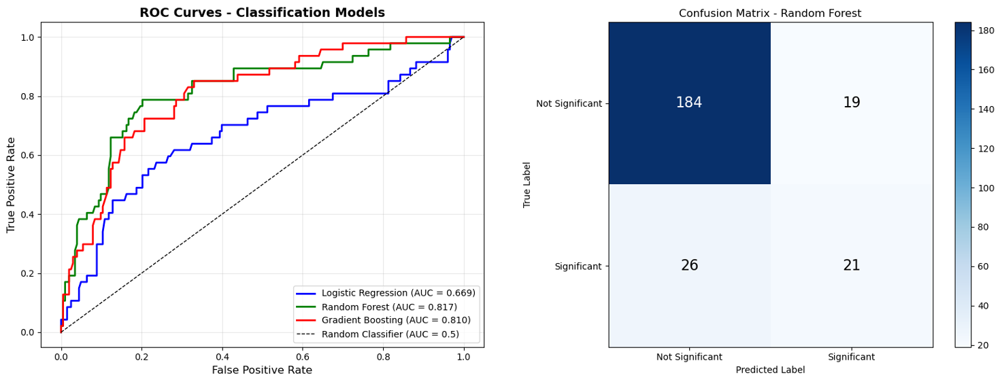
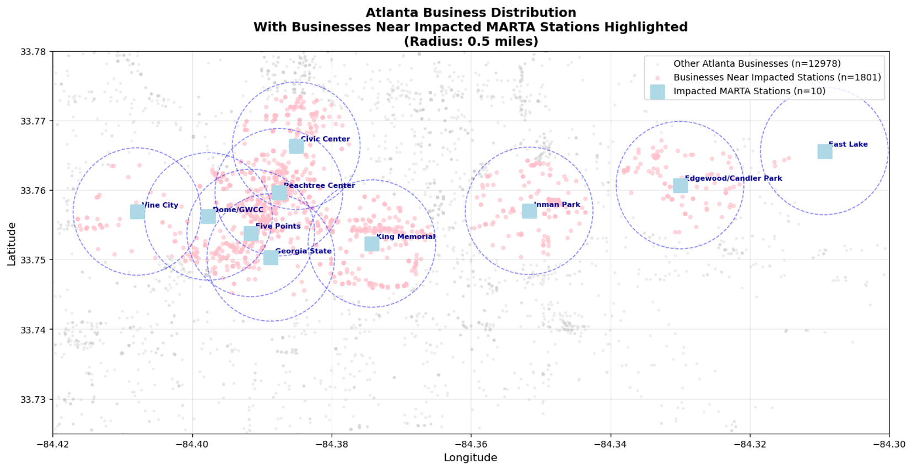
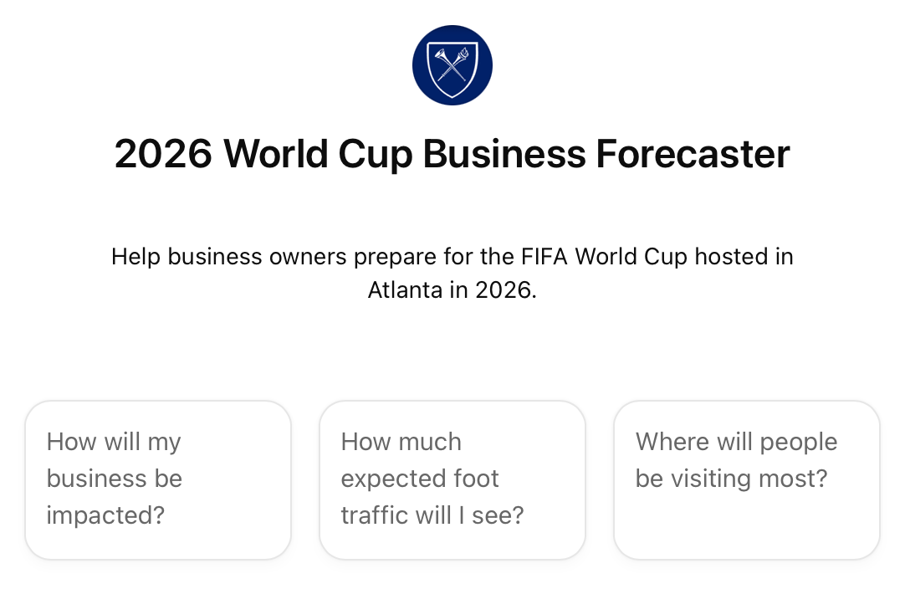
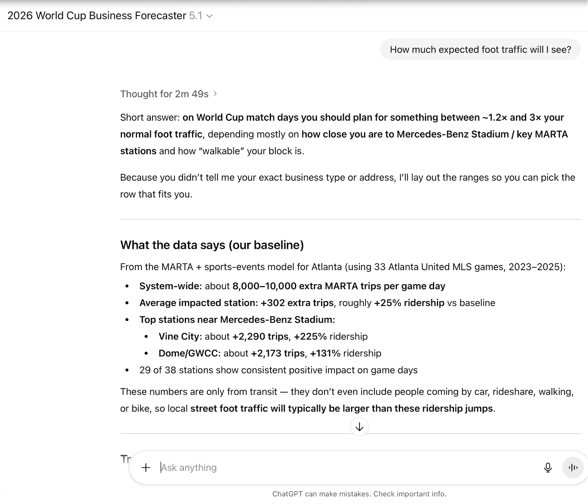

# AI.Data Lab – Fall 2025 - Forecasting the Impact of the 2026 FIFA World Cup on Atlanta Businesses
This project, conducted in partnership with Invest Atlanta, develops a data-driven framework and interactive LLM tool that helps Atlanta business owners anticipate foot traffic surges during the 2026 FIFA World Cup. Our analysis combines MARTA ridership data, business licensing information, and historical event patterns to identify which neighborhoods and stations are most likely to experience major increases in customer activity.
## Problem Overview
Atlanta will host major matches during the 2026 FIFA World Cup, bringing significant increases in tourism and transit usage. However, business owners lack localized, data-supported indicators of how much foot traffic they should expect and how to prepare.
Our goal is to translate complex ridership and event-pattern data into actionable intelligence for restaurants, retailers, hotels, and service providers across the city.

As shown on the poster , our work focuses on identifying:
1. Which MARTA stations and routes historically experience the largest increases during major sporting events of a similar size to the World Cup
2. How business density and type correlate with ridership spikes
3. How these insights can be extrapolated to the World Cup context

## Data Sources
We combined several datasets to build a comprehensive picture of event-driven movement across the city:
- City of Atlanta Business License Database - Used to map business density, industry types, and neighborhood composition.
- MARTA Bus and Rail Ridership (1/1/2023–8/31/2025)
    - Train ridership analyzed at the station level
    - Bus ridership analyzed at the route level
- Meta-Dataset of Major Sporting Events (2023–2025)
    - Built by cross-referencing Falcons, Atlanta United, SEC Championships, and other event dates with external sources. This allowed us to compare “event days” with baseline conditions.

## Research Goals
1. Link Events to Ridership Changes
Quantify ridership differences between event and non-event days, controlling for normal variation by using same-weekday and same-month baselines (as described in the Metrics section of the poster).
2. Connect Ridership Spikes to Business Patterns. We examined:
- Whether neighborhoods with denser clusters of restaurants, hotels, and retail show larger surges
- How business characteristics correlate with transit usage changes
- Whether geographic placement (latitude/longitude) predicts impact
3. Model the World Cup Impact
Using the above relationships, we built classification and regression models to estimate:
- The probability that a station will experience a significant ridership spike
- The magnitude of expected additional ridership
Finally, we wrapped these insights into an LLM interface that business owners can query to interpret impact predictions for their specific location.
## Methods
Our analysis proceeded across two main tracks:
### A. Bus + Train Ridership Analysis
Using our event meta-dataset, we compared ridership on event days with baseline periods.
Key steps:
- Construct station × date and route × date panels
- Measure significance of deviations from baseline (controlling for month and weekday)
- Visualize station and route-level changes
- Heat maps of ridership change across stations
- Ranked visualizations for station and route impact levels
### B. Business Licensing Analysis
We geocoded all Atlanta businesses and produced spatial density maps to compare business clusters against transit-impact hotspots.
These spatial overlays helped guide our recommendations for which business districts should prepare most actively.
## Modeling Results
We tested three predictive models to classify whether ridership would be significantly elevated on event days and to estimate the magnitude of increase.
1. Logistic Regression
- AUC: 0.6692
- High accuracy due to class imbalance but poor at identifying significant increases
- Not suitable for operational use
2. Random Forest Classifier — Best Overall Performer
- AUC: 0.8166
- Accuracy: 82%
- Precision (significant cases): 0.53
- Recall: 0.45
- F1: 0.48
- Top Predictive Features: Baseline ridership conditions and time of year are the largest drivers of prediction.
    - baseline_std — 24.1%
    - baseline_mean — 21.3%
    - month — 17.3%
    - longitude — 14.3%
    - latitude — 10.1%
3. Gradient Boosting Classifier
- AUC: 0.8102 (close second)
- Similar precision/recall balance
- Key Insight: Year-Specific Data Performs Best
    - Models trained solely on 2023 data reached an R² corresponding to 88% precision, outperforming multi-year models—a surprising result that warrants further investigation.

## Findings: Predicted High-Impact Stations
Based on classification probabilities and modeled ridership increases, stations fall into tiers of concern.
- Tier 1 — Highest Priority (>80% probability or >1,500 trips)
    - Edgewood/Candler Park — 90.9% probability; +665 trips
    - Vine City — +1,612 trips
    - Dome/GWCC — +1,854 trips
    - Doraville — 81.9% probability
Recommendation: Increase staff, extend service frequency, deploy crowd-management resources.

- Tier 2 — High Priority (50–80% or 500–1,500 trips)
    - Avondale — 78.9%; +394 trips
    - H.E. Holmes — 57.1%; +481 trips
    - East Lake — 32.9%; +577 trips
Recommendation: Enhanced staffing, monitoring, and contingency planning.

- Tier 3 — Moderate (20–50% or 200–500 trips)
    - Inman Park — 20.4%; +395 trips
    - Additional stations within this band
Recommendation: Standard procedures with moderate increases in readiness.

## Deliverable: The World Cup Business Forecaster LLM
Our final product is a context-specific language model that:
- Ingests all ridership, business, and event data
- Provides business owners with tailored predictions for their address or industry
- Offers operational recommendations based on modeled ridership outcomes

Link to the model: https://chatgpt.com/g/g-693744682a0c8191b81ea889e3cd33fb-2026-world-cup-business-forecaster

As shown in the final panel of the poster, this tool is designed to translate complex forecasting into actionable guidance for non-technical business stakeholders.
## Acknowledgments
We thank Invest Atlanta for providing our preliminary datasets, their guidance, and their continuous engagement throughout the project. Notably, thank to Nicole Torno for allowing some of us to present our findings at Invest Atlanta!
We also express appreciation to the faculty mentors and advisors who supported our weekly sessions and provided methodological and conceptual feedback during all those late Tuesday nights, including Dr. Kevin McAlister, Dr. Tyler Cook, and Avinash Pandey. Their expertise was crucial in getting us up to speed and in making data science more accessible.